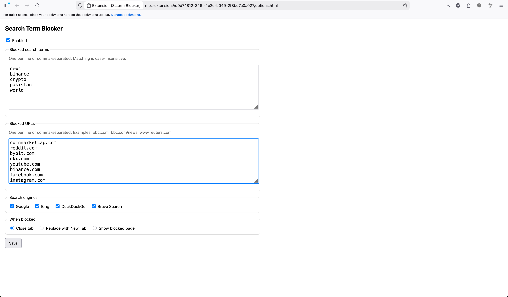

# Search Term Blocker (Browser Extension)

A small browser extension I made for myself to stop spiraling into searching for news.
It blocks searches that match your terms, blocks specific websites/paths, and can optionally hide video players with a simple “video” placeholder.

## Screenshots

## What it does

- Blocks searches when the query contains a blocked term
- Blocks direct visits to configured URLs and URL paths
  - Paste URLs with or without http/https
  - Paste with or without www
  - Both versions are matched automatically
- Optional: hide video players and embeds
  - Replaces HTML `<video>` and common embeds (YouTube, Vimeo, Loom) with a solid placeholder labeled “video”
- Behavior options when a navigation is blocked:
  - Close tab
  - Replace with New Tab
  - Show a blocked page
- Everything is editable in the extension Options UI

## Supported engines

- Google (all country domains)
- Bing
- DuckDuckGo
- Brave Search

## Install (Firefox, permanent)

1. Zip the extension files with `manifest.json` at the root.
2. Sign in to AMO Developer Hub: https://addons.mozilla.org/developers/
3. Submit a new add-on and choose unlisted/self-distribution.
4. Upload your `.zip` and finish submission.
5. Download the signed `.xpi` from Manage Status & Versions.
6. Open Firefox and go to `about:addons`.
7. Extensions → gear icon → Install Add-on From File.
8. Select the signed `.xpi` and approve the install prompt.
9. More info: https://extensionworkshop.com/documentation/publish/signing-and-distribution-overview/
10. Packaging guide: https://extensionworkshop.com/documentation/publish/package-your-extension/
11. Installing add-ons: https://support.mozilla.org/en-US/kb/find-and-install-add-ons-add-features-to-firefox

## Install (Chrome/Opera, developer mode)

1. Clone this repo
2. Open `chrome://extensions` (Opera: `opera://extensions`)
3. Enable Developer mode
4. Click Load unpacked
5. Select the extension folder

## Configure

- Open extension Details then Extension options
- Add blocked search terms (one per line)
- Add blocked URLs (one per line)
  - Examples: `bbc.com`, `bbc.com/news`, `www.reuters.com`
- Toggle Hide videos if you want video players replaced
- Pick the behavior

## Notes

- This extension cannot stop you from typing a term, it blocks the navigation before results fully load.
- Incognito/Private mode requires enabling it in the extension’s settings.
- Large rule lists can hit browser limits; keep the blocked lists reasonable.

## Development

No build step. Edit files, then reload the extension from the extensions page.

## License

MIT
